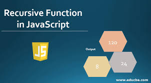
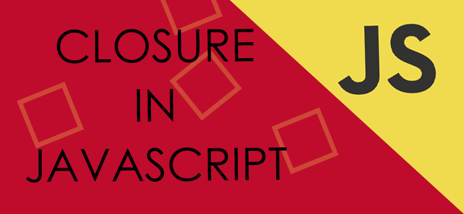

# Scope
# What is a scope in js ?
>The scope is the current context of execution in which values and expressions
are "visible" or can be referenced. If a variable or expression is not in the current
scope, it will not be available for use. Scopes can also be layered in a hierarchy, 
so that child scopes have access to parent scopes, but not vice versa.
• Global scope: The default scope for all code running in script mode.
• Function scope: The scope created with a function.
•
JavaScript has the following kinds of scopes:
Block scope: This scope restricts the variable that is declared 
inside a specific block, from access by the outside of the block.
Module scope: The scope for code running in module mode.

# The 3 types of scope
>JavaScript has 3 types of scope:
Block scope.
Function scope.
Global scope.

# The scope chain
>In JavaScript, the scope defines how and in which part of our code we can access the variables and functions. In simple terms, the scope helps us improve our code's security and readability.

# Hoisting 
# Hoisting in java script ?
>Hoisting is a JavaScript mechanism where variables and function 
declarations are moved to the top of their scope before code 
execution.
Hoisting in JavaScript is a behavior in which a function or a variable 
can be used before declaration.

# Recursion
>Recursion is when a function calls itself until someone stops it. If no one stops it then it'll 
recurse (call itself) forever. Recursive functions let you perform a unit of work multiple times.
Modern programming languages like JavaScript already have the for and while statements as
alternatives to recursive functions. But some languages like Closure do not have any looping
statements, so you need to use recursion to repeatedly execute a piece of code.

# Closure
>A closure is the combination of a function bundled together (enclosed) with references to 
its surrounding state (the lexical environment). In other words, a closure gives you 
access to an outer function's scope from an inner function

